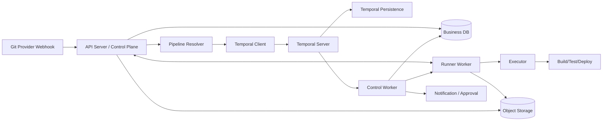

# Convey Engine 架构总览

- 状态：Draft v0.2
- 日期：2026-04-16
- 项目：Convey Engine
- 技术栈：Go、Gin、Temporal、GORM、Atlas、PostgreSQL / MySQL、Local / S3 Object Storage

## 1. 当前假设

本文将 Convey Engine 视为一类面向代码变更事件的轻量流水线执行引擎，核心目标是提供比 Jenkins / GitLab CI 更轻量、比零散脚本更可管理的构建、测试、部署编排能力。

当前技术路线已经收敛为：

1. 工作流编排使用 Temporal。
2. 业务元数据使用关系型数据库，默认 PostgreSQL，同时保持 MySQL 兼容。
3. 业务数据访问使用 GORM，业务 schema 迁移使用 Atlas。
4. 对象存储同时支持本地文件系统和 S3 兼容存储。
5. Temporal 自身持久化与业务数据库逻辑隔离，不共用同一套 schema 管理。

## 2. 背景与目标

Convey Engine 计划做成一款轻量化、自托管优先、易扩展的流水线执行引擎，用于连接代码仓库事件、任务编排、构建测试、制品产出与部署动作。

它不追求“一站式 DevOps 平台”，而是聚焦下面几件事：

1. 用简单配置描述流水线。
2. 用成熟工作流引擎承载超时、重试、审批等待与恢复语义。
3. 用业务数据库承载项目、流水线、运行记录、审计与制品元数据。
4. 用统一对象存储抽象承载日志归档与制品文件。
5. 用 Go 实现单体优先、角色可拆的服务结构，降低部署和维护成本。

## 3. 设计目标

### 3.1 核心目标

- 轻量部署：单机或小规模集群即可运行。
- 控制清晰：项目、流水线、运行记录、任务节点、部署记录可追踪。
- 易于扩展：仓库来源、执行器、通知器、部署器都能按接口扩展。
- 调度可靠：支持失败重试、长时间等待、幂等重放与人工批准。
- 观测完整：日志、状态、审计、基础指标齐全。
- 存储可切换：本地部署可用本地文件系统，生产可切到 S3 兼容存储。

### 3.2 非目标

- 首版不做完整 SaaS 多租户控制台。
- 首版不替代制品仓库、容器注册中心或 Kubernetes。
- 首版不做复杂 DAG 可视化编排器。
- 首版不做跨云统一部署平台。
- 首版不追求 PostgreSQL / MySQL 方言下所有高级特性完全等价。

## 4. 目标用户与场景

### 4.1 目标用户

- 中小团队平台工程师
- 需要替换重型 CI 工具的后端团队
- 希望统一脚本化构建与部署流程的研发团队

### 4.2 典型场景

1. Git push 后自动触发单元测试、构建镜像、推送制品。
2. 合并到主干后自动部署到测试环境，生产环境需人工批准。
3. 针对 monorepo 中某个子目录变更，按规则只触发部分流水线。
4. 为多个项目提供统一运行记录、审计与失败重试能力。
5. 在本地单机环境先用文件系统存储制品，后续无缝迁移到 S3。

## 5. 产品定位

Convey Engine 本质上是一个“轻量控制面 + 可扩展执行面”的任务编排引擎：

- 控制面负责接收事件、解析流水线、创建业务运行记录、暴露查询 API。
- 编排面由 Temporal 承载流程状态、重试、超时、审批等待与恢复。
- 执行面负责实际执行作业步骤、回传日志、上报结果、执行部署动作。
- 业务数据库作为事实查询源，承载可检索的业务状态与审计信息。
- 对象存储负责承载大体积日志分段与制品文件。

## 6. 总体架构



### 6.1 设计原则

- 编排优先：工作流状态、重试、超时、等待恢复由 Temporal 负责，不再自研核心调度状态机。
- 存储分层：业务数据库、Temporal 持久化数据库、对象存储职责分离。
- 业务优先兼容：业务数据库默认 PostgreSQL，同时保持 MySQL 兼容；Temporal 持久化可使用 PostgreSQL 或 MySQL。
- 对象存储抽象：统一 `ObjectStorage` 接口，首版提供 `local` 与 `s3` 两种实现。
- 配置先于界面：首版优先 `convey.yaml`，Web UI 可以后置。
- 接口先稳定：内部模块以 interface 解耦，方便后续替换执行器或存储适配器。

## 7. 核心模块设计

### 7.1 API Server

职责：

- 接收 Git webhook 与手动触发请求
- 提供项目、流水线、运行记录查询接口
- 提供取消运行、重新执行、批准部署等控制接口
- 作为 Temporal Client 启动 Workflow 或发送 Signal / Update
- 为前端或 CLI 提供统一读写入口

建议：

- HTTP 框架使用 Gin
- API 契约首版采用 REST + JSON
- API 层不直接承载长流程逻辑，只负责参数校验、权限校验和调用应用服务

### 7.2 Pipeline Resolver

职责：

- 从仓库指定版本读取 `convey.yaml`
- 解析 stages / jobs / steps / triggers / environments
- 校验配置合法性并生成标准化执行计划
- 对同一配置内容计算 hash，支持版本追踪与缓存

建议首版配置格式：

```yaml
version: 1
triggers:
  - type: push
    branches: [main]

stages:
  - name: test
  - name: build
  - name: deploy

jobs:
  - name: unit-test
    stage: test
    runs_on: docker
    steps:
      - run: go test ./...

  - name: image-build
    stage: build
    needs: [unit-test]
    steps:
      - run: docker build -t app:${GIT_SHA} .

  - name: deploy-staging
    stage: deploy
    needs: [image-build]
    environment: staging
    approval: manual
    steps:
      - run: ./scripts/deploy-staging.sh
```

### 7.3 Workflow Orchestrator

职责：

- 用 Workflow 表达一次 `run` 的生命周期
- 用 Activity 承载具体 job / step 执行、副作用操作与外部调用
- 用 Signal / Update 处理取消、重试、人工批准等控制动作
- 通过 Workflow Retry / Timeout Policy 统一失败恢复语义

建议：

- 以 `PipelineRunWorkflow` 作为首版主工作流
- 将“等待人工批准”设计为 Workflow 内部等待信号，而不是数据库轮询
- 将长耗时外部动作放入 Activity，避免在 Workflow 中直接执行 I/O

### 7.4 Worker & Executor

职责：

- `control worker` 运行 Temporal Worker，消费 Workflow / Activity 任务
- `runner worker` 原生常驻在执行节点，与控制面保持长连接
- 管理 step 生命周期、节点注册、心跳、宿主机探针与取消信号下发
- 执行 `docker` 或原生打包执行器类型步骤
- 实时回传 stdout / stderr / exit code，并最终回写业务元数据

首版建议支持两类执行方式：

1. `docker`：在受控容器里执行，作为 Linux 与具备 Docker Desktop/WSL2 节点的优先隔离模型
2. `packaged`：原生主机执行，但依赖打包 runtime、临时工作目录和清理策略，作为 macOS / Windows 必需路径

补充原则：

- Runner 默认不放 Docker，避免宿主机探针与系统集成变复杂
- 真正需要隔离的是 job 执行环境，而不是 runner 进程本身

### 7.5 Business Persistence

职责：

- 存储项目、流水线定义、运行记录、任务投影、制品元数据、审计日志
- 为前端查询和报表提供稳定读模型
- 保存对象存储引用而不是大体积二进制内容

建议：

- ORM 使用 GORM
- 业务 schema 迁移使用 Atlas
- 生产环境禁止依赖 `AutoMigrate` 作为正式迁移机制

### 7.6 Object Storage Subsystem

职责：

- 统一承载日志归档与制品文件
- 暴露 put / get / stat / delete / signed-url 等对象存储能力
- 屏蔽本地文件系统与 S3 的差异

首版建议支持：

1. `local`：基于本地目录，适用于开发环境与单机部署
2. `s3`：面向 AWS S3 或 S3 兼容实现，如 MinIO、Ceph RGW

约束：

- 业务数据库只保存元数据和对象定位信息
- 对象 key 命名应包含项目、run、job、step 维度，便于回收和排查

### 7.7 Secret & Integration Manager

职责：

- 管理仓库访问凭证、部署密钥、通知凭证
- 为 Activity 注入只读密钥视图
- 记录密钥引用而不是在日志中暴露原文

首版建议：

- 密钥值加密后存入业务数据库
- 主密钥由环境变量注入
- 后续可扩展 Vault / KMS

## 8. 数据与存储设计

### 8.1 业务数据库

业务数据库保存可查询业务事实，建议首版表如下：

| 表名 | 用途 | 关键字段 |
| --- | --- | --- |
| `projects` | 项目定义 | `id`, `name`, `repo_url`, `provider`, `default_branch` |
| `pipeline_defs` | 流水线定义 | `id`, `project_id`, `name`, `status` |
| `pipeline_versions` | 流水线配置版本 | `id`, `pipeline_def_id`, `version`, `config_raw`, `config_hash` |
| `triggers` | 触发器定义 | `id`, `project_id`, `type`, `filter_json`, `enabled` |
| `runs` | 一次流水线运行 | `id`, `project_id`, `pipeline_version_id`, `status`, `ref`, `commit_sha`, `temporal_workflow_id`, `temporal_run_id`, `triggered_by` |
| `run_jobs` | run 下的任务投影 | `id`, `run_id`, `worker_id`, `name`, `stage`, `status`, `started_at`, `finished_at` |
| `run_steps` | job 下的步骤投影 | `id`, `run_job_id`, `seq`, `kind`, `status`, `exit_code` |
| `workers` | runner / control 节点当前态 | `id`, `name`, `mode`, `status`, `platform`, `labels_json`, `last_heartbeat_at`, `current_job_id` |
| `worker_telemetry_snapshots` | 节点探针快照 | `id`, `worker_id`, `cpu_usage_pct`, `memory_used_pct`, `disk_used_pct`, `docker_available`, `collected_at` |
| `artifacts` | 制品元数据 | `id`, `run_id`, `run_job_id`, `storage_backend`, `bucket`, `object_key`, `kind`, `size_bytes`, `checksum` |
| `log_objects` | 日志对象元数据 | `id`, `run_id`, `run_job_id`, `run_step_id`, `storage_backend`, `bucket`, `object_key`, `seq` |
| `deployments` | 部署记录 | `id`, `run_id`, `environment`, `status`, `approver`, `revision` |
| `secret_refs` | 密钥引用 | `id`, `project_id`, `scope`, `name`, `ciphertext` |
| `audit_logs` | 审计日志 | `id`, `actor`, `action`, `target_type`, `target_id`, `payload_json` |

### 8.2 Temporal 持久化

- Temporal 持久化数据库由 Temporal 官方 schema 管理
- 业务应用不得用 GORM 或 Atlas 修改 Temporal 内部表
- 可选择 PostgreSQL 或 MySQL 作为 Temporal 持久化引擎
- 推荐与业务数据库逻辑隔离，至少分离数据库实例、数据库名或 schema

### 8.3 对象存储

- 日志与制品文件默认不落业务数据库
- 开发环境可使用本地目录，如 `./data/objects`
- 生产环境推荐 S3 兼容存储，并通过 bucket / prefix 做环境隔离
- 业务查询通过元数据表定位对象，再由 API 返回下载地址或流式内容

## 9. 运行流程

1. Git Provider 发送 webhook 到 API Server。
2. API 校验签名、匹配项目与触发器。
3. Resolver 拉取对应 commit 的 `convey.yaml` 并生成 pipeline version。
4. API 创建业务侧 `run` 记录，并启动对应 Temporal Workflow。
5. Workflow 按阶段、依赖和环境规则推进任务。
6. `control worker` 选择在线 `runner worker`，runner 通过与控制面的长连接接收 step 并执行。
7. Runner 持续上报 heartbeat 和宿主机 probe，控制面板基于当前态和快照展示节点健康。
8. Runner 实时回传日志和状态，并将制品上传到本地或 S3 对象存储。
9. `control worker` 将执行结果、对象元数据和审计事件回写业务数据库。
10. 如果涉及部署 gate，Workflow 等待批准 Signal 后继续。
11. Workflow 完成后更新最终 run 状态，并保留重试入口。

## 10. API 草案

### 10.1 外部接口

- `POST /api/v1/webhooks/{provider}`
- `POST /api/v1/projects/{projectId}/runs`
- `GET /api/v1/projects/{projectId}/runs`
- `GET /api/v1/runs/{runId}`
- `GET /api/v1/runs/{runId}/logs`
- `GET /api/v1/runs/{runId}/artifacts`
- `POST /api/v1/runs/{runId}/cancel`
- `POST /api/v1/runs/{runId}/retry`
- `POST /api/v1/deployments/{deploymentId}/approve`

### 10.2 内部边界

- API 不再暴露自定义 `claim` / `complete` 调度接口
- `control worker` 与 Temporal Server 通过 Temporal SDK / Task Queue 通信
- `runner worker` 通过长期控制通道完成注册、心跳、宿主机探针、任务下发与日志回传
- 日志或制品上传通过内部存储服务完成，不要求独立上传网关

说明：

- 首版建议 REST + JSON
- 日志读取先做分页轮询或对象拼接读取，后续可升级为 SSE / WebSocket

## 11. 建议仓库结构

```text
apps/
  web/
  server/
    cmd/
      convey-api/
      convey-worker/
    internal/
      api/
      app/
      pipeline/
      workflow/
      activity/
      executor/
      repository/
      storage/
        object/
          local/
          s3/
      integration/
      domain/
    migrations/
      atlas/

packages/
  shared/

docs/
```

### 11.1 结构原则

- 前端与后端共存于同一仓库，但保持应用边界清晰
- `apps/web` 负责控制台与用户界面
- `apps/server` 负责 API、工作流执行、持久化与对象存储适配
- `packages/shared` 负责跨前后端共享的契约与公共定义
- `workflow` 放 Temporal Workflow 定义与编排入口
- `activity` 放 Temporal Activity 实现
- `repository` 放 GORM repository 与查询实现
- `storage/object` 放 Local / S3 对象存储实现
- `cmd/*` 只负责装配，不承载业务逻辑

## 12. 部署建议

### 12.1 MVP 拓扑

- 1 个 `convey-api`
- N 个 `convey-worker`
- 1 套 Temporal Server
- 1 个业务数据库（PostgreSQL 优先，可兼容 MySQL）
- 1 个 Temporal 持久化数据库
- 1 个本地目录或 S3 兼容对象存储

### 12.2 运行模式

- 开发环境：单机 `docker compose`
- 生产环境：容器化部署优先，也可二进制 + systemd
- 本地部署：业务日志和制品可先落本地目录
- 多节点部署：对象存储建议切换为 S3 兼容后端

## 13. 安全与可靠性

- webhook 必须校验签名
- 密钥不可回显到日志
- run / deployment 的控制动作必须写审计日志
- Temporal Workflow ID 必须稳定可追踪，避免重复触发
- 对象上传必须校验 checksum 或 size，避免元数据与对象内容不一致
- Local 存储需定义目录权限与清理策略
- S3 存储需定义 bucket policy、加密与生命周期规则

## 14. 可观测性

- 结构化日志：`slog`
- 指标：运行数、失败率、平均耗时、队列长度、对象上传失败数
- tracing：接入 OpenTelemetry，贯通 API、Workflow、Activity、存储访问
- 健康检查：`/livez`、`/readyz`
- 关键链路：Webhook、Workflow 启动、Activity 执行、对象上传、审批等待

## 15. MVP 范围建议

首版建议只做下面能力：

1. GitHub webhook 触发
2. `convey.yaml` 解析与校验
3. Temporal 工作流编排
4. `docker` / `packaged` 两种执行器
5. run / job / step 查询接口
6. 本地对象存储与 S3 对象存储两种实现
7. 手动批准部署 gate
8. 失败重试与取消运行

明确延后：

- GitLab / Bitbucket 适配
- 复杂 UI
- 动态 pipeline 模板市场
- 多租户计费
- 更多对象存储供应商适配

## 16. 关键风险与待确认项

1. 首版部署目标需要明确：主机脚本、SSH、Kubernetes，还是容器平台。
2. 业务数据库双兼容范围需要明确：仅 CRUD 与常规索引，还是包含更复杂 JSON 查询。
3. 对象存储下载链路首版是否需要预签名 URL，还是由 API 统一代理下载。
4. run / job / step 投影是强一致更新还是最终一致更新，需要在实现前定清。
5. Worker 自注册、心跳和能力标签已是主路径，需要明确最小节点模型与调度约束。

## 17. 下一步建议

在这份架构文档确认后，建议继续补三份文档：

1. `docs/architecture/backend-stack-design.md`：落后端组件边界、Temporal 与 GORM 职责划分
2. `docs/architecture/schema-design.md`：落详细表结构、索引与迁移策略
3. `docs/architecture/api-design.md`：落 REST 接口契约与错误模型
